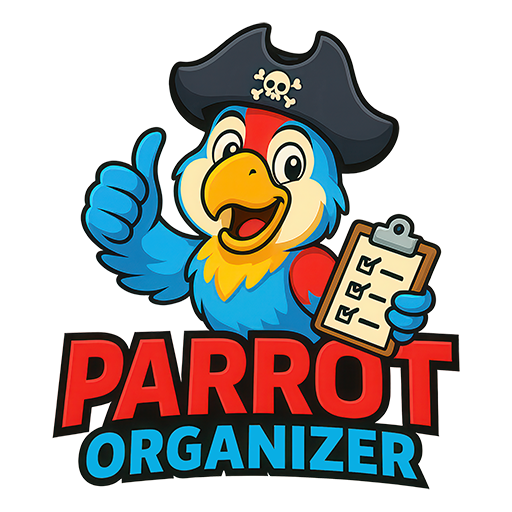

<p align="center">
  
</p>

<h1 align="center">Parrot Organizer v2.0</h1>

<p align="center">
  <strong>A fully rebuilt, modern web interface for managing your TeknoParrot arcade game library.</strong><br/>
  Browse, filter, search, and organize 500+ TeknoParrot games with rich metadata, box art, and a fast, responsive UI — all from your browser.
</p>

<p align="center">
  
  
  
  
  
</p>


<div style="display:flex;">
  
  
</div>

## What's New in v2.0

v2.0 is a ground-up rewrite. Every layer — the server, the data model, and the UI — has been rebuilt.

| Feature | v1.5.2 | v2.0 |
|---|---|---|
| UI Framework | Vanilla JS | React 18 (no build step) |
| Database | Single flat file | 3-tier merge system |
| Metadata | Basic descriptions | Full screenscraper.fr data |
| Genres | Single genre per game | Multi-genre with filtering per genre |
| Media | Icon art only | Box art, wheel logos, screenshots |
| Theme | Light/Dark toggle | OKLch color system, 5 accent colors |
| Sidebar | Always visible | Collapsible, all sections expand/collapse |
| Filters | Fixed filter set | Genre, Platform, Emulator, Controller, Publisher, Developer, Players, GPU, Year, Quick Filters |
| Sorting | 5 options | 19 sort options including random shuffle |
| Gamepad | Basic support | rAF polling, edge detection, stable callbacks |

---

## Features

### Game Library
- **500+ TeknoParrot games** with curated metadata, descriptions, and tags
- **Rich metadata from Screenscraper.fr** — developer, publisher, player count, ESRB rating, genre, synopsis
- **Multi-genre support** — games with multiple genres appear in all their genre filter buckets; first genre shown as the card pill
- **Box art & wheel logos** — downloaded media displayed in the detail panel hero
- **Install / Uninstall** — copy game profiles to UserProfiles with one click
- **One-click launch** — launch installed games directly without opening TeknoParrot UI
- **Favorites** — star games and filter to favorites only
- **Hide games** — remove unwanted games from view
- **Custom notes** — personal per-game notes stored in your own user database

### Search & Filters
- **Real-time search** across name, profile, platform, all genres, tags, description, developer, publisher
- **Collapsible sidebar** — every filter group collapses independently; active filter count badge on each header
- **Sidebar toggle** — slide the entire sidebar open or closed to go full-width game grid
- **Filter groups:** Genre · Platform · Emulator · Controller · Publisher · Developer · Players · Year · GPU Compatibility · Quick Filters
- **Active filter chips** — see and remove individual active filters from the main area
- **Clear All** button appears only when filters are active

### Sorting
19 sort modes including Name, Year, Genre, Platform, Emulator, Controls, Subscription status, Installed/Not Installed, Favorites first, and Random shuffle.

### Views
- **Grid view** — game icon cards with genre pill, year, GPU compatibility badges
- **List view** — compact sortable table with column-header sort controls
- **Card sizes** — Small / Medium / Large via Tweaks panel
- **Show/hide metadata** on cards via Tweaks panel

### Game Detail Panel
Clicking any game opens a detail panel showing (in order):
1. Box art hero (or icon art fallback with blurred background)
2. Launch / Install / Folder / Edit Info buttons
3. Genre tags (primary highlighted, secondary dimmed)
4. Description (4-line clamp with Read More expand)
5. Gameplay video link
6. Tags
7. Settings / Controls editors (installed games)
8. Spec grid — Platform, Emulator, Released, Subscription, Developer, Publisher, Players, ESRB, Wheel Rotation
9. Controls / input type tags
10. GPU Compatibility (Nvidia / AMD / Intel)
11. Personal notes textarea
12. Hide game toggle
13. Metadata courtesy attribution

### In-App Editors
- **Edit Info** — override name, developer, publisher, players, genre, platform, controls, tags, YouTube link, description, metadata source — all stored in your personal user database
- **Settings Editor** — edit game path and all XML settings without opening TeknoParrot UI
- **Controls Editor** — remap gamepad and keyboard controls with real-time input capture; clear individual bindings

### Themes & Customization
- **Dark / Light mode** toggle
- **5 accent colors** — Cyan, Amber, Magenta, Lime, Violet
- **3 backgrounds** — Clean, Grid, Scanlines
- **Card density** — Comfy / Compact
- **Reset UI Preferences** — returns all tweaks to defaults

### App Settings (gear icon)
- **Refresh Game List** — rescan GameProfiles and Metadata folders, rebuild database
- **Reset Favorites / Hidden Games / Custom Profiles / Everything** — with confirmation dialogs
- **Export Settings** — download your personal database (`userDB.json`) as a backup
- **Import Settings** — restore from a backup file
- **Push Custom Profiles to DB2** *(developer only)* — promote curated edits into the shared database for distribution

### Gamepad Navigation
Full controller support using requestAnimationFrame polling with edge detection:
- **D-Pad / Left Stick** — navigate game grid
- **A** — launch selected game
- **B** — close detail panel / deselect
- **X** — toggle favorite
- **Y** — open detail panel
- **LB / RB** — cycle Installed / Not Installed / All filter
- **Start** — open Tweaks panel
- **Select** — toggle grid / list view
- **Left Stick Click** — jump to first game

Gamepad is automatically paused when any editor or modal is open.

### Keyboard Shortcuts
| Key | Action |
|---|---|
| `⌘K` / `Ctrl+K` | Focus search |
| `← → ↑ ↓` | Navigate grid |
| `PgUp / PgDn` | Jump by page |
| `H` | Jump to first game |
| `Enter` | Launch selected game |
| `F` | Toggle favorite |
| `V` | Toggle grid / list |
| `S` | Open Tweaks panel |
| `Esc` | Close panels / deselect |

---

## Quick Start

### Requirements
- **TeknoParrot** installed
- **Node.js** (any recent LTS version)
- A modern browser (Chrome, Edge, Firefox)

### Installation

1. **Place the `ParrotOrganizer` folder inside your TeknoParrot folder:**

```
TeknoParrot/
├── GameProfiles/
├── UserProfiles/
├── Metadata/
├── Icons/
├── TeknoParrotUi.exe
└── ParrotOrganizer/    ← place here
    ├── start.bat
    ├── server.js
    ├── index.html
    └── ...
```

2. **Launch the app:**

Double-click `start.bat` — the server starts and your browser opens automatically at:
```
http://localhost:8000/ParrotOrganizer/
```

3. **Done.** Games are scanned and loaded automatically.

---

## Database Architecture

Parrot Organizer uses a three-tier database that merges at startup. Each tier overrides the one below it.

```
teknoparrotDB.json        ← Tier 1: Auto-scanned from GameProfiles/ + Metadata/
                              Rebuilt on every startup. Never edited manually.

parrotOrganizerDB.json    ← Tier 2: Curated overrides (descriptions, genres, metadata)
                              Maintained by the developer. Distributed with updates.
                              Populated via screenscraper.fr import and the Push tool.

userDB.json               ← Tier 3: Your personal data (favorites, hidden, notes,
                              custom edits). Never overwritten by app updates.
                              Exportable and importable via App Settings.

teknoparrot_database.json ← Merged output. Read by the UI at load time.
                              Rebuilt whenever any tier changes.
```

**Priority:** userDB (Tier 3) wins over parrotOrganizerDB (Tier 2) wins over teknoparrotDB (Tier 1).

This means app updates can deliver improved metadata without ever touching your personal favorites, notes, or customizations.

---

## File Structure

```
ParrotOrganizer/
├── index.html            Entry point
├── server.js             Node.js backend (game scanning, launch, DB management)
├── start.bat             Launch script
├── styles.css            All styling (OKLch color system, theme variables)
│
├── src/                  React components (loaded via Babel standalone, no build step)
│   ├── app.jsx           Main app — layout, filtering, sorting, gamepad
│   ├── components.jsx    GameCard, ListRow, DetailPanel, GameIcon, LaunchPopup
│   ├── data.jsx          DB loader, field mapping, color utilities
│   ├── app-settings.jsx  App Settings modal (gear icon)
│   ├── metadata-editor.jsx  Edit Info modal
│   ├── settings-editor.jsx  Game Settings editor
│   ├── controls-editor.jsx  Controls remapper
│   ├── tweaks-panel.jsx  Theme / layout / display tweaks
│   ├── debug-log.jsx     Server log viewer
│   └── useGamepad.jsx    Gamepad hook (rAF polling, edge detection)
│
├── data/                 Database files
│   ├── teknoparrotDB.json       Tier 1 — auto-scanned TeknoParrot data
│   ├── parrotOrganizerDB.json   Tier 2 — curated metadata
│   ├── userDB.json              Tier 3 — your personal data
│   └── teknoparrot_database.json  Merged output (auto-generated)
│
├── logo/                 Branding assets (all resolutions + favicon)
├── Media/                Downloaded box art, wheel logos, screenshots (per game)
└── storage/              Runtime logs (debug.log)
```

The `dev/` folder (sibling to the above) contains developer tools and is not required to run the app:
```
dev/
├── index.html + scraper.js   Screenscraper.fr metadata import tool
├── scraper-config.json       API credentials (not committed)
└── teknoparrot_screenscaper_metadata.json  Source metadata file
```

---

## Metadata

Game metadata in Parrot Organizer comes from three sources:

| Source | Fields | Credit |
|---|---|---|
| **TeknoParrot** | Game name, emulator, GPU info, controls, subscription status | TeknoParrot GameProfiles + Metadata |
| **Screenscraper.fr** | Synopsis, developer, publisher, players, ESRB, release date, genre, box art, wheel logo, screenshots | [screenscraper.fr](https://www.screenscraper.fr) |
| **You** | Custom names, notes, favorites, hidden, YouTube links, tags | Your personal `userDB.json` |

All metadata courtesy is shown at the bottom of each game's detail panel.

---

## Troubleshooting

**App doesn't start:**
- Make sure Node.js is installed and on your PATH (`node --version` in a terminal)
- Make sure `ParrotOrganizer` is inside your TeknoParrot folder (not a subfolder)
- Check that `TeknoParrotUi.exe` is in the parent folder

**No games load:**
- The app looks for `GameProfiles/` in the parent folder (your TeknoParrot installation)
- Click the gear icon → **Refresh Game List** to force a rescan

**Game won't launch:**
- The game must be installed first (install = copy to UserProfiles)
- Confirm `TeknoParrotUi.exe` is in the TeknoParrot root folder

**Debug log:**
- Click the terminal icon in the topbar to open the Debug Log panel
- Logs are also written to `storage/debug.log`

---

## License

MIT — see [LICENSE](LICENSE) for details.

---

<p align="center">
  Built for the TeknoParrot community · Metadata courtesy of <a href="https://www.screenscraper.fr">Screenscraper.fr</a>
</p>
